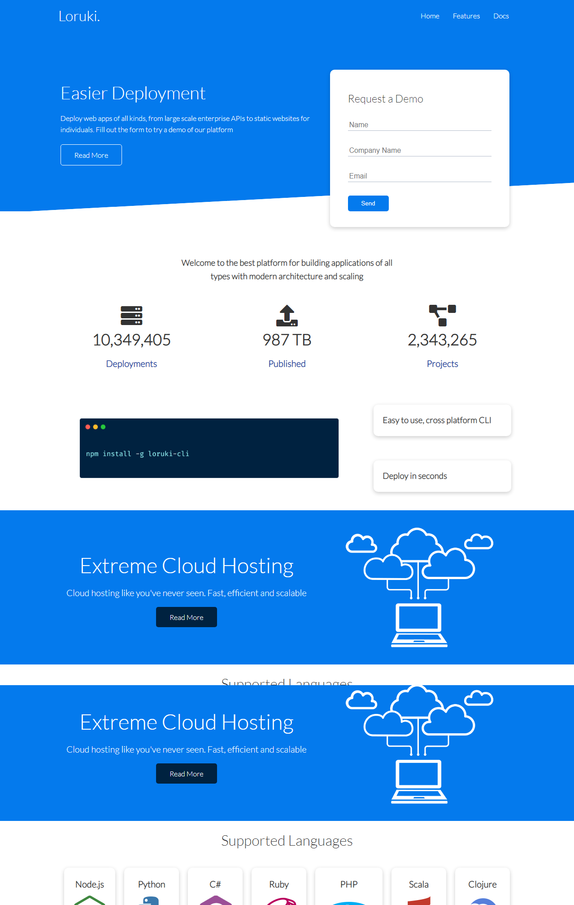
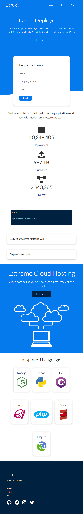
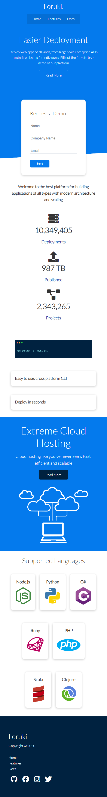

# Project Title :

## Weblify
___

#link to the live website:
[Weblify](https://weblifyhost.netlify.app/ "weblify live site")
___

# Description :

## Weblify is a static web hosting platform, contains 3 pages
 * Home
 * Features
 * Documentation
____

## What it does ?

### Merely a static webpage & it accepts form, so send me a message.
___

# Tech Used :

## Html, CSS, git, github, Netlify.
___

# Design image :

## Desktop View
;

## Tablet View

;

## Mobile View

;

# Credits
BradTraversy 